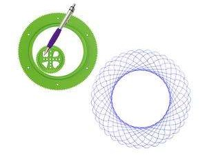

# Flowers-Curve

To use my online drawer, please visit [https://hanzhi713.github.io/Flowers-Curve/](https://hanzhi713.github.io/Flowers-Curve/)

## Introduction

Flowers curve is a type of Chinese art. In practice, these curves are drawn by moving a small gear inside a ring gear

Based on similar mechanics, I designed this webpage for drawing flowers curve in browser. 
The first GIF is produced with all circles and skeletons shown.

  

## Instructions

See my [wiki](https://github.com/hanzhi713/Flowers-Curve/wiki)